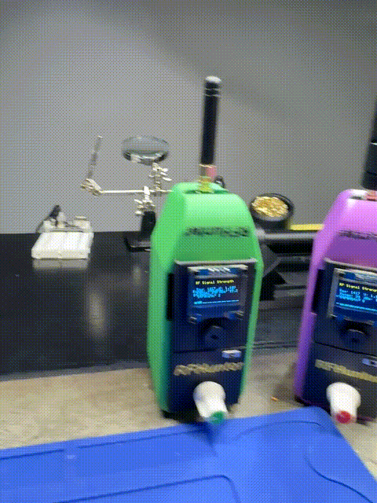

# RFHunter V4.0

This project is an RF Signal Scanner built using an ESP32, AD8317 RF detector, and various other components. It's designed to detect and measure RF signals in the environment and display the signal strength on an OLED display. It's useful to find hidden cameras, wiretapping devices, and other RF-enabled devices.

<center>
</center>

## Ready for Primetime


This video had V3 which required a 9V battery and an external USB Power Supply. V4 here snaps together with zero tools, has space in the bottom for a battery, and a charge controller, and in place of the 9V batter you have a boost converter.  Now you only need 1 battery, and it should last weeks or months depending on usage cycles.

<center></center>


## Author

Matthew Rogers a simple hacker from the United States.
- Website: [matthewrogers.org](https://matthewrogers.org)
- Twitter: [@rogerscissp](https://x.com/rogerscissp)
- LinkedIn: [Matthew Rogers](https://www.linkedin.com/in/matthewrogerscissp/)

## License

This project is licensed under the GNU General Public License v3.0 (GNU GPLv3). See the [LICENSE](LICENSE) file for details.

## Bill of Materials (BOM)

<center></center>

I listed the Amazon links in the .cpp file if you want to buy the parts. These are not affiliate links. You can buy these anywhere.

1. ESP32 Development Board
2. AD8317 RF Power Detector
3. TP4056 Lithium Battery Charge Controller
3.7V Lithium-ion Battery
4. Boost Converter (3.3V to 9V)
5. OLED Display (I2C, 128x64)
6. Potentiometer (10k)
7. Piezo Buzzer
8. Power Switch

## Build Process

1. Assemble the power circuit:
   - Connect the battery to the TP4056 charge controller
   - Connect the out from theTP4056 output to the power switch
   - Connect the power switch output to the ESP32 5v VIN and boost converter input
   - Adjust the boost converter output to 9V

  > Make sure the boost converter is set to 9V. If you don't have a 9V battery, you can use a 9V battery.

  > Make sure you use the 5V VIN and not the 3.3V VIN.

2. Connect the AD8317 RF detector:
   - Power the AD8317 with the 9V output from the boost converter
   - Connect the VOUT pin to ESP32 GPIO 34

3. Set up the OLED display:
   - Connect VCC to ESP32 3.3V
   - Connect GND to ESP32 GND
   - Connect SDA to ESP32 GPIO 21
   - Connect SCL to ESP32 GPIO 22

4. Connect the potentiometer:
   - Connect VCC to ESP32 3.3V
   - Connect GND to ESP32 GND
   - Connect the wiper to ESP32 GPIO 35

5. Connect the piezo buzzer:
   - Connect the positive terminal to ESP32 GPIO 5
   - Connect the negative terminal to ESP32 GND

6. Flash the ESP32 with the provided code:

   ```
   git clone https://github.com/ramborogers/rfhunter.git
   cd rfhunter
   pio run -t upload
   ```
   >**You shouldn't need to change any of the code.**

7. Snap the case together


## Wiring Instructions

Wiring Guide for RFHunter:

### Power Circuit:
1. Battery (3.7V) positive terminal -> Power Switch
2. Power Switch -> TP4056 Charge Controller (B+)
3.TP4056 OUT+ -> ESP32 VIN and Boost Converter IN+
4. Boost Converter OUT+ (adjusted to 9V) -> AD8317 VCC
5. Battery negative terminal -> TP4056 B- and ESP32 GND and Boost Converter IN-
6. Boost Converter OUT- -> AD8317 GND

### Signal and Control:

7. AD8317 VOUT -> ESP32 GPIO 34 (RF_SENSOR_PIN)
8. Potentiometer VCC -> ESP32 3.3V
9. Potentiometer GND -> ESP32 GND
Potentiometer Wiper -> ESP32 GPIO 35 (POT_PIN)
10. OLED Display VCC -> ESP32 3.3V
11. OLED Display GND -> ESP32 GND
12. OLED Display SDA -> ESP32 GPIO 21 (OLED_SDA)
13. OLED Display SCL -> ESP32 GPIO 22 (OLED_SCL)
14. Piezo Buzzer positive -> ESP32 GPIO 5 (BUZZER_PIN)
15. Piezo Buzzer negative -> ESP32 GND

## Notes:

- The power switch controls the main power flow from the battery.
- The TP4056 charge controller manages battery charging and protection.
- The boost converter steps up the 3.3V from the battery to 9V for the AD8317 sensor.
- All GND connections should be common.
Double-check all connections and voltage levels before powering on.


## Usage

1. Power on the device using the power switch
2. The OLED display will show the current RF signal strength
3. Use the potentiometer to adjust the sensitivity
4. The piezo buzzer will sound when strong RF signals are detected

## Improvements and Feedback

We're always looking for ways to improve this project. If you have any ideas or suggestions, please feel free to open an issue or submit a pull request on our GitHub repository.

If you build your own RF Signal Scanner based on this project, we'd love to see it! Please share your creation on Twitter/X and tag @rogerscissp. Your feedback and experiences are valuable to the community!

Happy building!

Matthew Rogers

> The best idea for a date, his and hers RF Hunters!

<center>

</center>